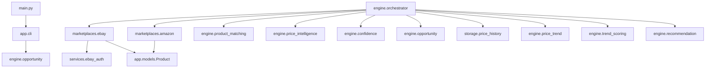
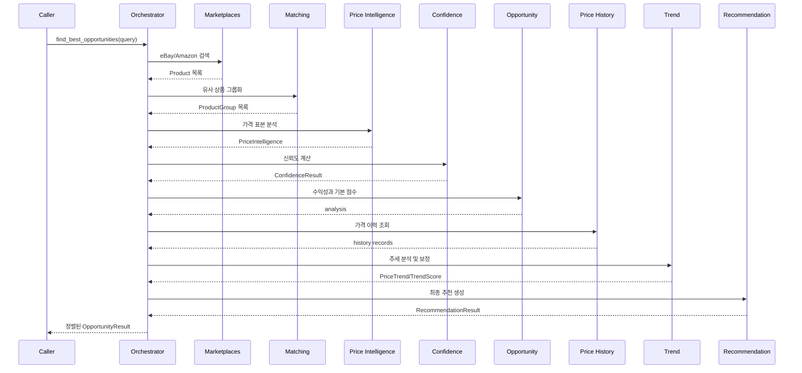

# HYB Opportunity AI Architecture

> 현재 업로드된 코드 기준 시스템 구조

## 1. 전체 구조



## 2. 계층별 책임

### Entry / Presentation

- `main.py`: 프로그램 진입점
- `app/cli.py`: 현재 데모 출력 담당

### Marketplace Integration

- `marketplaces/ebay.py`: eBay 검색과 공통 Product 변환
- `marketplaces/amazon.py`: Amazon 테스트 데이터와 Product 변환
- `services/ebay_auth.py`: eBay Application Token 발급
- `config/settings.py`: 환경 변수와 eBay URL 설정

### Domain Analysis

- `engine/product_matching.py`: 상품명 유사도와 매칭 판정
- `engine/price_intelligence.py`: 가격 표본 분석
- `engine/confidence.py`: 가격 분석 신뢰도
- `engine/opportunity.py`: 수익성 및 기본 기회 점수
- `engine/price_trend.py`: 저장 가격 이력 분석
- `engine/trend_scoring.py`: 추세 점수 보정
- `engine/recommendation.py`: 최종 추천 등급과 설명
- `engine/orchestrator.py`: 전체 분석 흐름 조정

### Storage

- `storage/price_history.py`: SQLite 기반 가격 이력 저장과 조회
- `database/models.py`: 별도 Product 모델이 있으나 현재 핵심 흐름과 모델이 다름

### Testing

- `tests/`: 핵심 모듈 단위 테스트
- 현재 결과: 67개 테스트 통과

## 3. 실제 통합 분석 흐름



## 4. 현재 핵심 문제

### Product 모델 중복

`app.models.Product`와 `database.models.Product`의 필드가 다르다. 공통 도메인 모델을 하나로 통합해야 한다.

### 데모와 실제 흐름 분리

`main.py`는 Orchestrator가 아니라 단일 하드코딩 상품 계산을 실행한다. 실제 검색 흐름으로 연결해야 한다.

### 실제 데이터와 목업 혼재

Amazon은 목업 데이터이며 eBay는 실 API를 사용한다. 결과 모델에 데이터 출처와 실행 모드를 포함해야 한다.

### 점수 역할 중복

Opportunity와 Recommendation에서 동일한 요인이 반복 반영될 수 있다. 점수 생성과 결과 표현의 책임을 분리해야 한다.

## 5. 목표 구조

대규모 재작성 없이 현재 폴더를 유지한다.

```text
HYB_Opportunity_AI/
├── app/                 # CLI 및 향후 API/UI 진입점
├── collectors/          # 공통 어댑터와 파싱 도구
├── config/              # 환경 설정
├── database/            # 향후 영속 모델 및 DB 관리
├── engine/              # 순수 분석 로직
├── market_data/         # 시장 스냅샷 모델
├── marketplaces/        # 외부 마켓 연동
├── services/            # 인증 및 외부 서비스
├── storage/             # 저장소 구현
├── tests/               # 자동 테스트
└── docs/                # 공식 문서
```

추가 폴더보다 우선할 것은 데이터 모델과 호출 흐름의 일관성이다.

## 6. 의존성 원칙

1. `engine/`은 UI를 알지 않는다.
2. 마켓별 API 응답은 공통 Product로 변환한 뒤 엔진에 전달한다.
3. 저장소 구현은 인터페이스 뒤에 숨긴다.
4. 추천 결과에는 계산 근거와 데이터 신뢰도를 포함한다.
5. 외부 네트워크 없이 엔진 테스트가 가능해야 한다.
6. 실제 데이터와 목업 데이터를 명확히 구분한다.

---

문서 버전: 0.2.0  
갱신일: 2026-07-21
